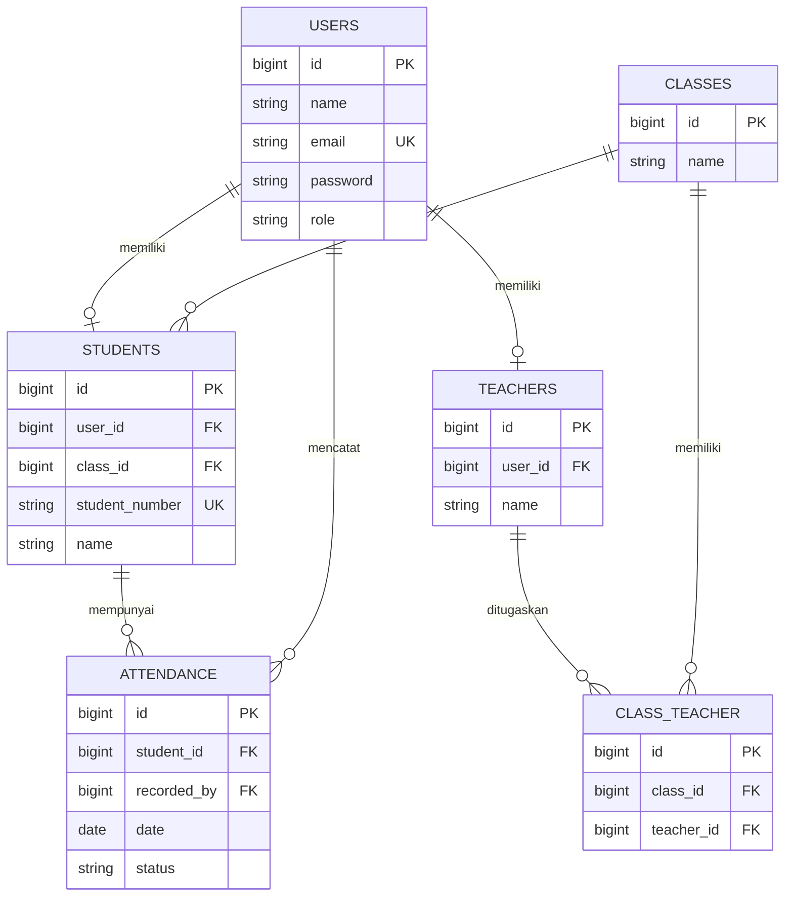
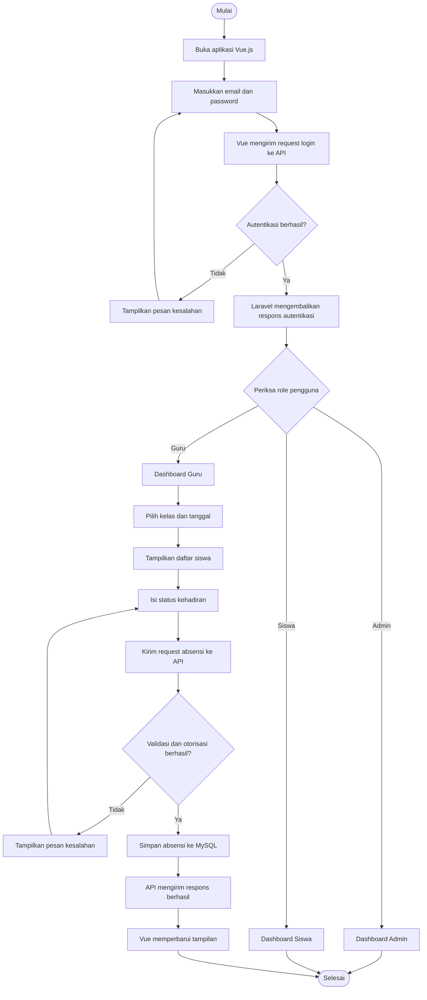
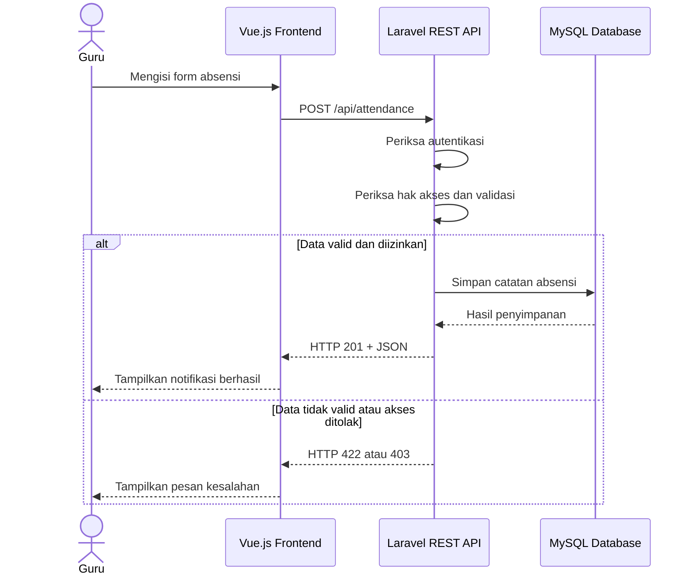

# Sistem Absensi Siswa
Aplikasi web untuk mengelola data siswa, kelas, guru, dan pencatatan kehadiran siswa. Proyek ini dibuat menggunakan Laravel sebagai REST API backend, Vue.js sebagai frontend, dan MySQL sebagai database.
## 1. Deskripsi Proyek
Sistem Absensi Siswa merupakan aplikasi berbasis web yang membantu proses pencatatan dan pengelolaan kehadiran siswa secara digital. Aplikasi ini dirancang agar admin dapat mengelola data, guru dapat mencatat kehadiran siswa, dan siswa dapat melihat riwayat kehadirannya.
Proyek ini dibuat sebagai portofolio pengembangan web dengan menerapkan pemisahan frontend dan backend, pengelolaan database relasional, autentikasi pengguna, serta komunikasi melalui REST API.
## 2. Tujuan
* Mempermudah pencatatan kehadiran siswa.
* Mengelola data siswa, guru, dan kelas dalam satu sistem.
* Menyimpan riwayat kehadiran ke dalam database.
* Memudahkan pencarian dan pemantauan data absensi.
* Menerapkan pengembangan aplikasi menggunakan Laravel REST API dan Vue.js.
* Menghasilkan kode yang sederhana, rapi, mudah dibaca, dan mudah dikembangkan.
## 3. Teknologi yang Digunakan
| Teknologi       | Kegunaan                              |
| --------------- | ------------------------------------- |
| PHP             | Bahasa pemrograman backend            |
| Laravel         | Framework backend dan REST API        |
| MySQL           | Database relasional                   |
| Vue.js 3        | Framework frontend                    |
| Vite            | Development server dan build frontend |
| Vue Router      | Pengaturan navigasi halaman           |
| Axios           | Mengirim HTTP request ke REST API     |
| CSS biasa       | Mengatur tampilan dan layout          |
| Laravel Sanctum | Autentikasi session-cookie untuk SPA   |
**Ketentuan frontend:** gunakan CSS biasa dengan selector seperti `.sidebar`, `.dashboard`, `.attendance-table`, dan `.form-group`. Jangan menggunakan Tailwind CSS, Bootstrap, atau framework CSS lainnya.
Gunakan JavaScript dengan Vue.js 3 Composition API dan `<script setup>` jika sesuai dengan struktur proyek.
## 4. Jenis Pengguna dan Hak Akses
### Admin
* Login ke sistem.
* Melihat dashboard admin.
* Mengelola data siswa.
* Mengelola data guru.
* Mengelola data kelas.
* Mengatur penugasan guru pada kelas.
* Melihat dan memfilter data absensi.
* Melihat laporan kehadiran.
### Guru
* Login ke sistem.
* Melihat dashboard guru.
* Melihat kelas yang ditugaskan kepadanya.
* Melihat daftar siswa dalam kelas.
* Mencatat dan memperbarui absensi siswa sesuai hak akses.
* Melihat riwayat absensi kelas yang menjadi tanggung jawabnya.
### Siswa
* Login ke sistem jika akun siswa tersedia.
* Melihat dashboard siswa.
* Melihat riwayat kehadiran pribadi.
* Melihat ringkasan jumlah hadir, izin, sakit, dan alpa.
Setiap role harus memiliki batasan akses yang jelas. Menyembunyikan tombol pada frontend saja tidak cukup. Backend Laravel wajib memeriksa hak akses pengguna.
## 5. Fitur Utama
1. Autentikasi login dan logout.
2. Dashboard berdasarkan role pengguna.
3. CRUD data siswa.
4. CRUD data kelas.
5. Pengelolaan data guru.
6. Penugasan guru ke kelas.
7. Pencatatan absensi siswa.
8. Riwayat dan pencarian absensi.
9. Filter absensi berdasarkan tanggal, kelas, siswa, dan status.
10. Ringkasan statistik kehadiran.
11. Validasi data pada frontend dan backend.
12. Pesan kesalahan dan notifikasi ketika proses berhasil atau gagal.
13. Antrean notifikasi WhatsApp wali untuk absensi `alpa`, `izin`, atau `sakit` (memerlukan konfigurasi Cloud API).
Status absensi yang digunakan:
* `hadir`: siswa hadir.
* `izin`: siswa tidak hadir dengan izin.
* `sakit`: siswa tidak hadir karena sakit.
* `alpa`: siswa tidak hadir tanpa keterangan.
Gunakan nilai status yang konsisten di seluruh aplikasi. Jika diperlukan, nilai internal database dapat menggunakan bahasa Inggris, seperti `present`, `excused`, `sick`, dan `absent`, asalkan pemetaan ke tampilan bahasa Indonesia jelas dan konsisten.
## 6. Rancangan Database
Database menggunakan MySQL dengan nama yang disesuaikan saat konfigurasi lingkungan lokal.
### Tabel `users`
Menyimpan akun pengguna dan informasi autentikasi.
| Kolom      | Keterangan                             |
| ---------- | -------------------------------------- |
| id         | Primary key                            |
| name       | Nama pengguna                          |
| email      | Email unik untuk login                 |
| password   | Password yang sudah di-hash            |
| role       | Role pengguna: admin, guru, atau siswa |
| created_at | Waktu data dibuat                      |
| updated_at | Waktu data diperbarui                  |
### Tabel `classes`
Menyimpan data kelas.
| Kolom      | Keterangan            |
| ---------- | --------------------- |
| id         | Primary key           |
| name       | Nama kelas            |
| created_at | Waktu data dibuat     |
| updated_at | Waktu data diperbarui |
### Tabel `students`
Menyimpan informasi siswa.
| Kolom          | Keterangan                                                      |
| -------------- | --------------------------------------------------------------- |
| id             | Primary key                                                     |
| user_id        | Foreign key ke users, boleh NULL jika siswa belum memiliki akun |
| class_id       | Foreign key ke classes                                          |
| student_number | Nomor induk siswa yang unik                                     |
| name           | Nama siswa                                                      |
| parent_whatsapp_phone | Nomor WhatsApp orang tua/wali dalam format internasional; boleh NULL |
| created_at     | Waktu data dibuat                                               |
| updated_at     | Waktu data diperbarui                                           |
### Tabel `teachers`
Menyimpan informasi guru.
| Kolom      | Keterangan            |
| ---------- | --------------------- |
| id         | Primary key           |
| user_id    | Foreign key ke users  |
| name       | Nama guru             |
| created_at | Waktu data dibuat     |
| updated_at | Waktu data diperbarui |
### Tabel `class_teacher`
Menghubungkan guru dengan kelas yang diajarnya.
| Kolom      | Keterangan              |
| ---------- | ----------------------- |
| id         | Primary key             |
| class_id   | Foreign key ke classes  |
| teacher_id | Foreign key ke teachers |
| created_at | Waktu data dibuat       |
| updated_at | Waktu data diperbarui   |
Kombinasi `class_id` dan `teacher_id` harus unik agar penugasan yang sama tidak tercatat berulang kali.
### Tabel `attendance`
Menyimpan catatan kehadiran siswa.
| Kolom       | Keterangan                                 |
| ----------- | ------------------------------------------ |
| id          | Primary key                                |
| student_id  | Foreign key ke students                    |
| recorded_by | Foreign key ke users yang mencatat absensi |
| date        | Tanggal absensi                            |
| status      | Status kehadiran                           |
| created_at  | Waktu data dibuat                          |
| updated_at  | Waktu data diperbarui                      |
Terapkan unique constraint pada kombinasi `student_id` dan `date` untuk mencegah satu siswa memiliki lebih dari satu catatan absensi pada tanggal yang sama.
Gunakan foreign key, validasi, dan aturan penghapusan data yang sesuai. Hindari penghapusan berantai yang dapat menghilangkan riwayat absensi tanpa sengaja.
### Tabel `attendance_notifications`
Menyimpan status antrean/pengiriman notifikasi absensi. Satu pasangan `attendance_id`
dan `trigger_status` hanya boleh memiliki satu riwayat agar status absensi yang sama
tidak memicu pengiriman berulang. Kolom pentingnya adalah `recipient_phone`, `status`,
`attempts`, `last_error`, `provider_message_id`, dan `sent_at`.
## 7. Entity Relationship Diagram (ERD)
Diagram berikut menggambarkan hubungan antartabel utama.

Keterangan:
* `PK` berarti Primary Key.
* `FK` berarti Foreign Key.
* `UK` berarti Unique Key.
* Satu kelas dapat memiliki banyak siswa.
* Guru dapat ditugaskan ke satu atau beberapa kelas.
* Satu siswa dapat memiliki banyak catatan absensi pada tanggal yang berbeda.
* `recorded_by` menyimpan akun pengguna yang mencatat absensi.
* Akun siswa dapat bersifat opsional jika sistem tetap mengizinkan siswa tanpa login.
ERD ini merupakan rancangan awal. Jika kebutuhan sekolah berubah, struktur database dapat disesuaikan melalui migration baru.
## 8. Rancangan REST API
Gunakan prefix `/api` untuk endpoint backend.
### Autentikasi
| Method | Endpoint      | Kegunaan                                  |
| ------ | ------------- | ----------------------------------------- |
| POST   | `/api/login`  | Login pengguna                            |
| POST   | `/api/logout` | Logout pengguna                           |
| GET    | `/api/me`     | Mendapatkan informasi pengguna yang login |
Autentikasi SPA menggunakan cookie session Laravel Sanctum. Frontend harus meminta
`GET /sanctum/csrf-cookie` sebelum login, kemudian mengirim request dengan cookie
dan header XSRF. Atur `SANCTUM_STATEFUL_DOMAINS` dan `CORS_ALLOWED_ORIGINS` pada
lingkungan backend agar mencakup host dan port frontend.
Contoh konfigurasi Axios:
```javascript
axios.defaults.withCredentials = true;
axios.defaults.withXSRFToken = true;
await axios.get(`${API_URL}/sanctum/csrf-cookie`);
await axios.post(`${API_URL}/api/login`, { email, password });
```
### Dashboard
| Method | Endpoint         | Kegunaan                                       |
| ------ | ---------------- | ---------------------------------------------- |
| GET    | `/api/dashboard` | Mengambil statistik dashboard berdasarkan role |
### Siswa
| Method | Endpoint             | Kegunaan                       |
| ------ | -------------------- | ------------------------------ |
| GET    | `/api/students`      | Menampilkan daftar siswa       |
| POST   | `/api/students`      | Menambahkan siswa              |
| GET    | `/api/students/{id}` | Menampilkan detail siswa       |
| PUT    | `/api/students/{id}` | Memperbarui data siswa         |
| DELETE | `/api/students/{id}` | Menghapus siswa jika diizinkan |
### Kelas dan guru
| Method | Endpoint                     | Kegunaan                                      |
| ------ | ---------------------------- | --------------------------------------------- |
| GET    | `/api/classes`               | Menampilkan daftar kelas                      |
| POST   | `/api/classes`               | Menambahkan kelas                             |
| GET    | `/api/classes/{id}`          | Menampilkan detail kelas                      |
| PUT    | `/api/classes/{id}`          | Memperbarui kelas                             |
| DELETE | `/api/classes/{id}`          | Menghapus kelas jika diizinkan                |
| GET    | `/api/teachers`              | Menampilkan daftar guru                       |
| POST   | `/api/teachers`              | Membuat akun dan data guru                    |
| GET    | `/api/teachers/{id}`         | Menampilkan detail guru                       |
| PUT    | `/api/teachers/{id}`         | Memperbarui data guru                         |
| DELETE | `/api/teachers/{id}`         | Menghapus guru jika tidak memiliki riwayat    |
| GET    | `/api/classes/{id}/students` | Menampilkan siswa pada kelas tertentu         |
| GET    | `/api/teacher/classes`       | Menampilkan kelas yang ditugaskan kepada guru |
| GET    | `/api/class-assignments`     | Menampilkan penugasan guru dan kelas          |
| POST   | `/api/class-assignments`     | Menugaskan guru ke kelas                      |
| DELETE | `/api/class-assignments/{id}`| Menghapus penugasan guru                      |
Pengelolaan data kelas, siswa, guru, penugasan, dan laporan dibatasi untuk admin.
Guru hanya dapat melihat kelas yang ditugaskan kepadanya dan mengelola absensi
kelas tersebut. Siswa hanya dapat melihat riwayat absensinya sendiri.
### Absensi
| Method | Endpoint                  | Kegunaan                               |
| ------ | ------------------------- | -------------------------------------- |
| GET    | `/api/attendance`         | Menampilkan data absensi dengan filter |
| POST   | `/api/attendance`         | Menyimpan catatan absensi              |
| GET    | `/api/attendance/{id}`    | Menampilkan detail absensi             |
| PUT    | `/api/attendance/{id}`    | Memperbarui absensi jika diizinkan     |
| DELETE | `/api/attendance/{id}`    | Menghapus absensi jika diizinkan       |
| GET    | `/api/reports/attendance` | Menampilkan laporan kehadiran          |
Pencatatan dan perubahan absensi dibatasi untuk admin serta guru yang ditugaskan
pada kelas siswa. Satu siswa hanya dapat memiliki satu catatan absensi per tanggal.
Status yang diterima API adalah `hadir`, `izin`, `sakit`, dan `alpa`.
Gunakan pagination untuk daftar data yang berpotensi panjang. Terapkan filter tanggal, kelas, siswa, dan status melalui query parameter.
Contoh:
`GET /api/attendance?date=2026-10-08&class_id=1&status=hadir`
Sesuaikan daftar endpoint dengan kebutuhan implementasi. Jangan membuat endpoint hanya untuk menambah jumlah kode.
## 9. Alur Kerja Aplikasi

## 10. Alur Komunikasi Frontend dan Backend

## 11. Struktur Folder yang Disarankan
Gunakan struktur terpisah jika frontend dan backend dikembangkan sebagai dua aplikasi.
```text
sistem-absensi/
├── backend/
│   ├── app/
│   ├── database/
│   │   ├── migrations/
│   │   ├── factories/
│   │   └── seeders/
│   ├── routes/
│   │   └── api.php
│   ├── tests/
│   ├── .env.example
│   └── README.md
├── frontend/
│   ├── src/
│   │   ├── assets/
│   │   ├── components/
│   │   ├── layouts/
│   │   ├── router/
│   │   ├── services/
│   │   ├── views/
│   │   ├── App.vue
│   │   └── main.js
│   ├── public/
│   ├── .env.example
│   └── package.json
└── README.md
```
Struktur ini merupakan rekomendasi, bukan aturan mutlak. Jika proyek sudah memiliki struktur folder tertentu, pertahankan struktur yang ada dan jangan memindahkan file tanpa alasan yang jelas.
## 12. Ketentuan Tampilan Frontend
Gunakan desain dashboard yang sederhana, konsisten, dan mudah digunakan.
Halaman yang perlu dibuat:
* Login.
* Dashboard admin.
* Dashboard guru.
* Dashboard siswa.
* Data siswa.
* Data kelas.
* Data guru.
* Form pencatatan absensi.
* Riwayat absensi.
* Laporan kehadiran.
* Halaman akses ditolak atau tidak ditemukan jika diperlukan.
Komponen yang dapat digunakan kembali:
* Navbar.
* Sidebar.
* Tabel data.
* Form input.
* Tombol aksi.
* Modal konfirmasi.
* Pagination.
* Filter data.
* Notifikasi.
* Loading state.
* Empty state.
Gunakan CSS biasa. Pisahkan CSS jika memang membantu keterbacaan. Hindari membuat terlalu banyak komponen kecil yang sebenarnya tidak diperlukan.
Tampilan harus responsif untuk laptop dan perangkat mobile.
## 13. Standar Kode
Semua kode wajib mengikuti ketentuan berikut:
1. Gunakan penamaan variabel, fungsi, class, dan file yang jelas.
2. Tulis kode yang mudah dibaca dan dipahami programmer lain.
3. Hindari kode yang terlalu singkat tetapi sulit dimengerti.
4. Hindari duplikasi kode yang tidak perlu.
5. Hindari abstraksi, design pattern, library, dan dependency yang tidak diperlukan.
6. Gunakan fitur bawaan Laravel dan Vue.js selama sudah cukup.
7. Pisahkan tanggung jawab kode sesuai kebutuhan.
8. Gunakan validasi Laravel untuk data yang diterima backend.
9. Gunakan relasi Eloquent untuk mengakses data yang berhubungan.
10. Jangan menaruh seluruh logika aplikasi dalam satu controller atau satu komponen Vue.
11. Jangan menyimpan password dalam bentuk teks biasa.
12. Jangan mempercayai data, role, atau identitas pengguna yang dikirim langsung dari frontend.
13. Jangan menggunakan data dummy hardcoded sebagai pengganti API setelah integrasi backend tersedia.
14. Jangan menambahkan fitur di luar kebutuhan tanpa alasan yang jelas.
15. Berikan komentar hanya ketika kode membutuhkan penjelasan tambahan.
## 14. Keamanan
* Gunakan autentikasi Laravel Sanctum atau mekanisme autentikasi yang sesuai dengan arsitektur proyek.
* Untuk SPA yang menggunakan autentikasi berbasis cookie, konfigurasi session, CSRF, CORS, dan domain dengan benar.
* Jika menggunakan token, simpan dan kirim token dengan mekanisme yang sesuai. Hindari penyimpanan token sensitif yang tidak aman.
* Hash password menggunakan mekanisme bawaan Laravel.
* Terapkan authorization pada setiap endpoint yang membutuhkan pembatasan akses.
* Validasi seluruh input di backend.
* Gunakan proteksi mass assignment melalui konfigurasi model yang sesuai.
* Cegah absensi ganda untuk siswa dan tanggal yang sama.
* Jangan mempercayai `recorded_by` dari request frontend. Tentukan pencatat dari pengguna yang sedang terautentikasi.
* Jangan mengirim password atau data sensitif dalam respons API.
* Jangan memasukkan file `.env`, password database, API key, token, atau data pribadi asli ke repository publik.
* Gunakan data dummy untuk pengembangan dan pengujian.
REST API tidak otomatis mengharuskan adanya banner persetujuan cookie. Penggunaan cookie untuk session autentikasi dan fitur persetujuan cookie adalah dua hal yang berbeda.
## 15. Format Respons API
Gunakan format respons JSON yang konsisten.
Contoh respons berhasil:
```json
{
  "message": "Data absensi berhasil disimpan.",
  "data": {
    "id": 1,
    "student_id": 10,
    "date": "2026-10-08",
    "status": "hadir"
  }
}
```
Contoh respons validasi gagal:
```json
{
  "message": "Data yang dikirim tidak valid.",
  "errors": {
    "status": [
      "Status absensi tidak valid."
    ]
  }
}
```
Gunakan HTTP status code sesuai kondisi:
* `200`: permintaan berhasil.
* `201`: data berhasil dibuat.
* `401`: pengguna belum terautentikasi.
* `403`: pengguna tidak memiliki izin.
* `404`: data tidak ditemukan.
* `409`: konflik data, misalnya duplikasi absensi jika penanganannya menggunakan status ini.
* `422`: validasi gagal.
* `500`: terjadi kesalahan server yang tidak terduga.
Jangan mengirim detail internal server atau informasi sensitif kepada pengguna.
## 16. Tahapan Pengembangan
Pengembangan dilakukan bertahap. Selesaikan dan periksa satu tahap sebelum melanjutkan tahap berikutnya.
### Tahap 1: Database dan Migration
Buat migration untuk tabel:
1. `users`
2. `classes`
3. `students`
4. `teachers`
5. `class_teacher`
6. `attendance`
Tugas tahap ini:
* Tentukan tipe data dan kolom setiap tabel.
* Tentukan primary key dan foreign key.
* Tentukan unique constraint yang diperlukan.
* Tentukan nullable column dan aturan penghapusan data.
* Buat relasi database yang konsisten dengan ERD.
* Buat model Eloquent dan relasinya.
* Buat factory atau seeder untuk data pengujian.
* Pastikan migration dapat dijalankan dari database kosong.
Jangan lanjut sebelum struktur database dan relasinya berjalan dengan benar.
### Tahap 2: Backend Laravel REST API
Implementasikan backend menggunakan Laravel.
Tugas tahap ini:
* Konfigurasi koneksi MySQL.
* Implementasikan login dan logout.
* Implementasikan endpoint informasi pengguna.
* Buat middleware atau mekanisme otorisasi sesuai role.
* Buat endpoint CRUD siswa dan kelas.
* Implementasikan pengelolaan data guru dan penugasan guru ke kelas.
* Buat endpoint pencatatan dan pengambilan absensi.
* Buat endpoint laporan dan statistik dashboard.
* Terapkan validasi request.
* Terapkan pagination dan filter yang diperlukan.
* Gunakan format JSON dan HTTP status code yang konsisten.
Jangan membuat seluruh logika dalam satu controller. Gunakan struktur Laravel yang wajar dan sederhana.
### Tahap 3: Pengujian Backend dan API
Sebelum membuat seluruh tampilan frontend, pastikan backend dapat digunakan dengan benar.
Tugas tahap ini:
* Uji login dengan kredensial yang valid dan tidak valid.
* Uji akses endpoint tanpa login.
* Uji batasan akses setiap role.
* Uji CRUD siswa dan kelas.
* Uji pencatatan absensi yang valid.
* Uji penolakan status absensi yang tidak valid.
* Uji pencegahan absensi ganda.
* Uji guru yang mencoba mengakses kelas di luar penugasannya.
* Uji filter tanggal, kelas, dan status.
* Uji penanganan data yang tidak ditemukan.
* Pastikan seluruh pengujian dapat dijalankan secara konsisten.
Gunakan Laravel Feature Tests dan database pengujian. Jangan menggunakan data siswa asli untuk pengujian.
### Tahap 4: Frontend Vue.js
Setelah API utama berjalan, buat antarmuka menggunakan Vue.js 3.
Tugas tahap ini:
* Buat halaman login.
* Buat navigasi dan layout dashboard.
* Buat halaman sesuai role pengguna.
* Buat tabel dan form data siswa.
* Buat halaman data kelas dan guru.
* Buat halaman pencatatan absensi.
* Buat halaman riwayat dan laporan absensi.
* Buat komponen loading, empty state, notifikasi, dan error.
* Terapkan CSS biasa tanpa Tailwind atau Bootstrap.
* Gunakan Vue Router untuk navigasi.
* Siapkan service Axios untuk berkomunikasi dengan API.
Gunakan struktur komponen yang sederhana. Jangan membuat seluruh halaman dalam satu file Vue.
### Tahap 5: Integrasi dan Pemeriksaan Akhir
Setelah tahap 1 sampai 4 selesai:
* Hubungkan seluruh halaman frontend dengan endpoint backend.
* Periksa autentikasi dan pembatasan akses.
* Periksa alur penyimpanan serta pembaruan absensi.
* Periksa respons API ketika terjadi kesalahan.
* Uji tampilan di laptop dan perangkat mobile.
* Pastikan konfigurasi lingkungan tidak bocor ke repository.
* Perbarui dokumentasi instalasi dan penggunaan.
Tahap ini dilakukan setelah fondasi database, backend, pengujian, dan frontend tersedia.
## 17. Instalasi dan Menjalankan Proyek
Jalankan perintah dari direktori utama repository; di sinilah file `artisan`
dan `package.json` berada.
### Persyaratan
* PHP `>=8.3` dan `<9.0`, sesuai batas versi `^8.3` di `composer.json`.
* Composer untuk memasang dependency Laravel.
* Node.js `^20.19.0` atau `>=22.12.0` dan npm, sesuai persyaratan Vite yang terkunci.
* Server database MySQL yang dapat diakses untuk menjalankan aplikasi lokal.

### Backend
Pasang dependency:
```bash
composer install
```
Salin `.env.example` menjadi `.env`, lalu isi konfigurasi database lokal. Pastikan
`.env` menunjuk ke database pengembangan yang benar sebelum menjalankan migration;
jangan gunakan data produksi untuk pengembangan atau pengujian.
Untuk frontend Vue yang berjalan di origin berbeda, sesuaikan `SANCTUM_STATEFUL_DOMAINS`
dan `CORS_ALLOWED_ORIGINS` pada `.env` dengan origin frontend. Request Axios harus
mengaktifkan `withCredentials` dan `withXSRFToken`, serta meminta `/sanctum/csrf-cookie`
sebelum login.
Buat application key:
```bash
php artisan key:generate
```
Jalankan migration:
```bash
php artisan migrate
```
Jalankan hanya pada database lokal yang sudah dipastikan benar. Perintah ini membuat
struktur tabel; `DatabaseSeeder` tidak membuat akun atau data contoh.
Jalankan server pengembangan:
```bash
php artisan serve
```
### Frontend
Frontend Vue berada di dalam aplikasi Laravel, bukan di folder `frontend` terpisah.
Buka terminal baru di direktori utama repository.
Pasang dependency:
```bash
npm ci
```
Jalankan Vite:
```bash
npm run dev
```
Di terminal lain, jalankan aplikasi Laravel dengan `php artisan serve`. Halaman Vue
disajikan oleh Laravel sehingga Axios menggunakan origin aplikasi yang sama untuk API
dan autentikasi session Sanctum. Pastikan `SANCTUM_STATEFUL_DOMAINS` mencakup host dan
port Laravel yang digunakan.
## 18. Pengujian
Jalankan pengujian backend menggunakan:
```bash
php artisan test
```
Konfigurasi PHPUnit menggunakan SQLite `:memory:` dan factory untuk membuat data uji;
test tidak memerlukan akun demo atau database aplikasi. Seeder tidak menyediakan
kredensial login bawaan. Untuk uji browser manual, gunakan akun uji buatan sendiri
di database pengembangan yang terisolasi, bukan akun atau data produksi.

Belum ada script tes otomatis frontend pada `package.json`. Periksa bundle frontend
dengan:
```bash
npm run build
```
Tes notifikasi menggunakan mock/fake untuk pengirim atau HTTP; tes otomatis tidak
mengirim pesan WhatsApp sungguhan.
## 19. Notifikasi WhatsApp
Pengiriman memakai WhatsApp Business Platform Cloud API dan job antrean. Konfigurasi
berikut dibaca dari `.env` dan tidak boleh ditulis sebagai kredensial di source code:
`WHATSAPP_ACCESS_TOKEN`, `WHATSAPP_PHONE_NUMBER_ID`, `WHATSAPP_API_VERSION`,
`WHATSAPP_TEMPLATE_NAME`, dan `WHATSAPP_TEMPLATE_LANGUAGE`.

Provider belum dikonfigurasi pada lingkungan/repository ini; nilai wajib Cloud API
belum tersedia. Sebelum mengaktifkan pengiriman, siapkan kredensial resmi dan template
yang disetujui Meta. Template harus menerima parameter nama siswa, status absensi,
dan tanggal secara berurutan. Pastikan koneksi antrean yang dipilih aman, lalu jalankan
worker (`php artisan queue:work`) hanya pada lingkungan yang memang boleh mengirim
pesan. Jangan memakai worker produksi untuk pengujian; gunakan mock/fake.
## 20. Instruksi untuk AI di VS Code
Gunakan ketentuan berikut ketika mengembangkan proyek ini dengan AI di VS Code.
1. Periksa seluruh struktur folder dan file yang sudah tersedia sebelum mengubah kode.
2. Baca `README.md` ini sebagai panduan utama kebutuhan proyek.
3. Jangan menghapus atau menimpa kode yang sudah benar tanpa alasan yang jelas.
4. Kerjakan proyek berdasarkan tahapan pengembangan yang sudah ditentukan.
5. Prioritaskan tahap database dan migration, kemudian backend REST API, pengujian API, dan frontend Vue.js.
6. Jangan langsung membuat semua fitur sekaligus. Selesaikan satu tahap, periksa hasilnya, lalu lanjutkan.
7. Gunakan Laravel, Vue.js 3, MySQL, Axios, Vue Router, dan CSS biasa sesuai kebutuhan proyek.
8. Jangan menggunakan Tailwind CSS atau Bootstrap.
9. Gunakan kode yang sederhana, jelas, konsisten, dan mudah dipahami programmer lain.
10. Jangan menambahkan library atau pola arsitektur yang tidak diperlukan.
11. Pastikan setiap relasi database sesuai dengan ERD.
12. Pastikan seluruh endpoint memiliki validasi dan otorisasi yang tepat.
13. Buat pengujian untuk fitur penting dan perbaiki error sebelum melanjutkan.
14. Setelah API tersedia, gunakan Axios untuk mengambil dan mengirim data. Jangan mempertahankan data dummy hardcoded sebagai data utama aplikasi.
15. Jangan mengklaim fitur atau pengujian berhasil sebelum benar-benar memeriksa hasilnya.
16. Jika terdapat konflik antara kode yang sudah ada dan dokumentasi ini, jelaskan perbedaannya terlebih dahulu dan pilih solusi yang paling sederhana serta konsisten.
17. Setelah menyelesaikan setiap tahap, jelaskan file yang dibuat atau diubah, fitur yang selesai, perintah yang perlu dijalankan, dan cara menguji hasilnya.
18. Jangan menampilkan, menyimpan, atau memasukkan kredensial asli dan file rahasia ke repository.
## 21. Status Pengembangan
Status berikut digunakan untuk memantau progres proyek.
* [x] Tahap 1: Database, migration, model, dan relasi.
* [x] Tahap 2: Backend Laravel REST API.
* [x] Tahap 3: Pengujian backend dan API.
* [x] Tahap 4: Frontend Vue.js dan CSS.
* [x] Tahap 5: Integrasi frontend dan backend.
* [x] Pengujian akhir dan perbaikan bug.
* [x] Dokumentasi instalasi selesai.
* [x] Implementasi notifikasi WhatsApp Cloud API dan pengujian dengan mock.
* [ ] Konfigurasi akun/provider WhatsApp dan verifikasi pengiriman nyata.
* [ ] Repository siap dipublikasikan.
## 22. Lisensi
Lisensi proyek dapat ditentukan setelah kebutuhan publikasi dipastikan. Jika ingin mengizinkan orang lain menggunakan, memodifikasi, dan mendistribusikan kode, pilih lisensi open-source yang sesuai dan sertakan file lisensinya.
---
**Catatan:** Proyek ini dikembangkan sebagai aplikasi pembelajaran dan portofolio. Gunakan data dummy untuk demonstrasi dan hindari memasukkan data pribadi siswa atau kredensial asli ke repository publik.